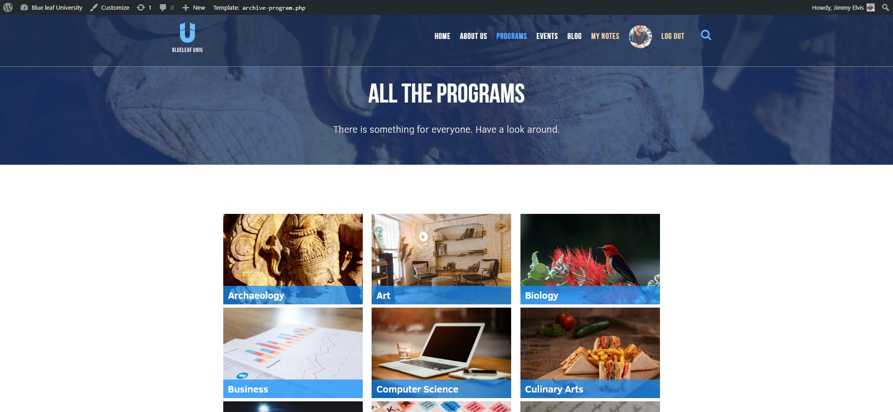
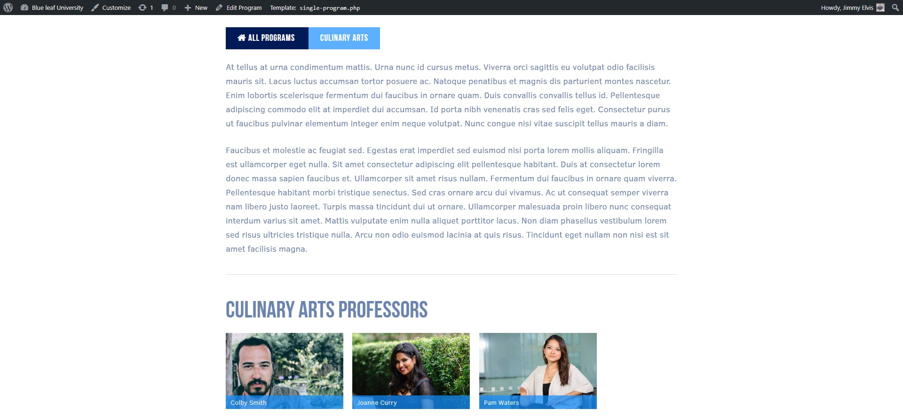
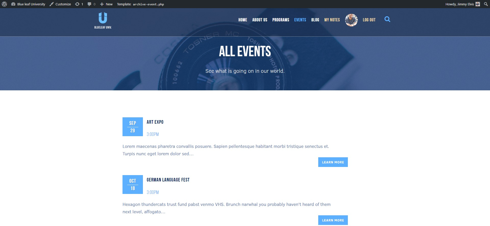
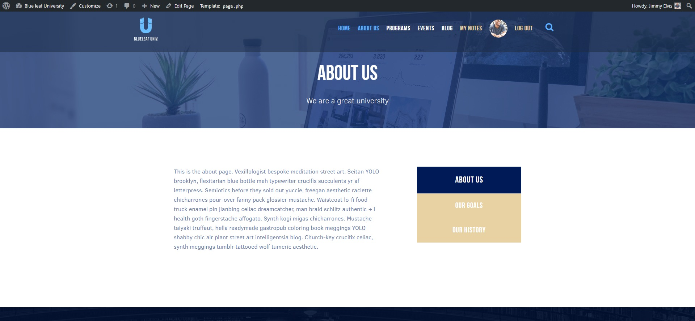
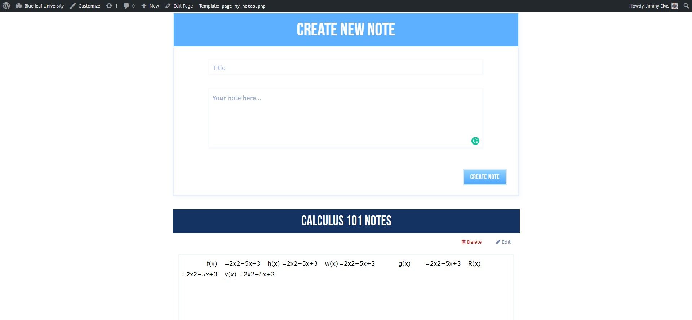
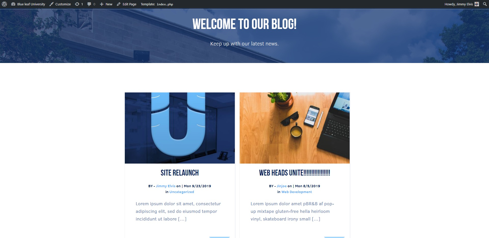
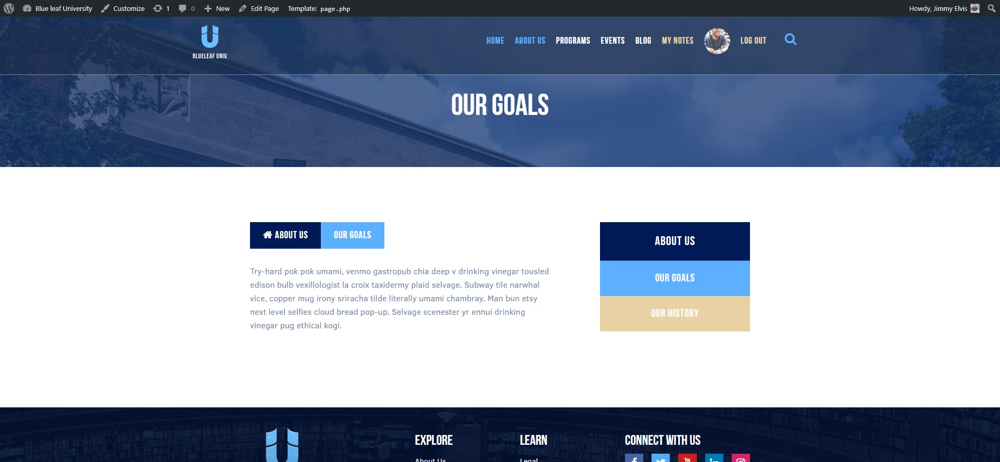

# 

# Blueleaf University

This is a very simple, fictional University site that's built with Wordpress, including a custom theme, that's built from scratch. Included in this theme are custom post types
such Professors, Programs, and Events posts which has custom fields unique to that post type. It also has relationships between different pieces of content, such as matching a professor with a major
or program that they teach. It also contains a javascript powered live search feature. It also uses the Wordpress API, to create a feature called my notes. Which is a very small app where a user type in notes for a class and save it to the Wordpress API.

<!-- Tables -->
|      |         |
| -------- | -------------- |
| | |
| | |
| | |
| | |

### Prerequisites

A localhost Xamp, Wamp etc. And Php, and Wordpress installed on your machine.

## Built With

* [PHP]
* [Wordpress]
* [JavaScript]
* [JQuery](https://jquery.com/)
* Stock photos from (https://www.pexels.com/)
